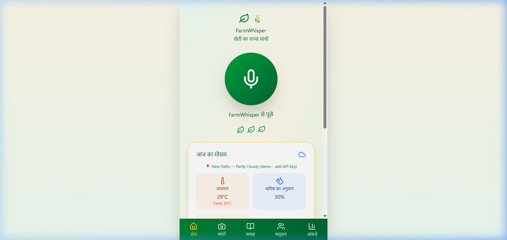

<div align="center">


# 🌾 FarmWhisper
### *खेती का सच्चा साथी — Your Farm's Trusted AI Companion*

> An AI-powered voice & vision assistant built for **Indian farmers** — helping them diagnose crops, get real-time weather, ask questions by voice, and connect with the farming community.


<br/>

[](https://fastapi.tiangolo.com/)
[](https://react.dev/)
[](https://aistudio.google.com/)
[](LICENSE)

</div>

---

## ✨ Features

| Feature | What it does |
|---|---|
| 🎤 **Voice Assistant** | Press mic → speak in **Hindi or English** → get an instant AI answer |
| 📷 **Crop AI Analysis** | Upload a photo → **Gemini Vision** identifies crop name, disease, water needs, and fertilizer |
| ☀️ **Real-time Weather** | Live weather for your village via **OpenWeatherMap** (temp, rain%, humidity, wind) |
| 📖 **Story Advisory** | Poetic farming wisdom generated by AI — **listen to it** with built-in Hindi TTS |
| 👥 **Community Feed** | Farmers share tips, upvote wisdom, and learn from each other |
| 📊 **Farm Analytics** | Soil health, growth stage, pest risk, and yield estimate charts |

---

## 📱 App Screens

```
🏠 Home           — Voice mic + real-time weather dashboard
📷 Photo (फोटो)   — Upload crop image → AI diagnosis + fertilizer advice
📖 Advisory (सलाह) — AI story + Hindi TTS playback
👥 Community       — Share & upvote farming tips
📊 Analytics       — Charts: moisture, pest risk, crop growth stage
```

---

## 🛠️ Tech Stack

### Frontend
- **React 18 + TypeScript** — fast, typed UI
- **Vite** — lightning-fast dev server
- **Framer Motion** — smooth animations
- **Recharts** — analytics charts
- **MediaRecorder API** — in-browser microphone recording
- **Web Speech API** — native browser TTS (no external service)
- **Lucide React** — beautiful icons

### Backend
- **Python FastAPI** — async REST API
- **Google Gemini 1.5 Flash** — crop image analysis + AI advisory
- **OpenWeatherMap API** — live weather data
- **SpeechRecognition** (Google STT) — Hindi/English voice transcription
- **pydub** — audio format conversion
- **python-dotenv** — environment config

---

## 🚀 Getting Started

### 1. Clone

```bash
git clone https://github.com/adixists/FarmWhisper.git
cd FarmWhisper
```

### 2. Get API Keys (Free)

| Key | Where to get it |
|---|---|
| `OPENWEATHER_API_KEY` | [openweathermap.org/api](https://openweathermap.org/api) — free tier |
| `GOOGLE_GEMINI_API_KEY` | [aistudio.google.com/apikey](https://aistudio.google.com/apikey) — free tier |

Create `farmwhisper-backend/.env`:
```env
OPENWEATHER_API_KEY=your_key_here
GOOGLE_GEMINI_API_KEY=your_key_here
```

### 3. Install & Run Backend

```bash
cd farmwhisper-backend
pip install -r requirements.txt
python -m uvicorn app.simple_main:app --reload --host 0.0.0.0 --port 8000
```

### 4. Install & Run Frontend

```bash
# In a new terminal, from the root directory
npm install
npm run dev
```

### 5. Open the App

| Service | URL |
|---|---|
| 🌐 App | http://localhost:3000 |
| ⚙️ Backend API | http://localhost:8000 |
| 📄 API Docs (Swagger) | http://localhost:8000/docs |

> **Without API keys** — the app still works with clearly-labelled demo data. Add keys and the backend auto-reloads.

---

## 📁 Project Structure

```
FarmWhisper/
├── src/
│   ├── components/
│   │   ├── VoiceHomeScreen.tsx      # Mic recording + weather + AI response
│   │   ├── ImageAnalysisScreen.tsx  # Crop photo upload + Gemini analysis
│   │   ├── StoryAdvisoryScreen.tsx  # AI story + Web Speech TTS
│   │   ├── CommunityScreen.tsx      # Community posts & upvotes
│   │   └── AnalyticsScreen.tsx      # Farm monitoring charts
│   ├── services/
│   │   └── api.ts                   # All backend API calls
│   └── App.tsx                      # Navigation & layout
│
├── farmwhisper-backend/
│   ├── app/
│   │   ├── main.py                  # All API routes + real integrations
│   │   ├── simple_main.py           # Uvicorn entry point
│   │   ├── routes/                  # Route handlers
│   │   ├── services/                # Business logic (weather, voice, crop)
│   │   └── models/                  # Pydantic data models
│   ├── requirements.txt
│   └── .env                         # ← Add your API keys here
│
├── package.json
├── vite.config.ts
├── README.md
└── RUNNING.md
```

---

## 🔌 API Endpoints

| Endpoint | Method | Description |
|---|---|---|
| `GET /health` | GET | Backend health + API key status |
| `POST /voice/query` | POST | Audio → transcription + AI answer |
| `POST /crop/analyze` | POST | Image → Gemini crop diagnosis |
| `POST /advice/story` | POST | Generate poetic AI advisory |
| `GET /weather/forecast` | GET | Weather by lat/lon |
| `GET /weather/location` | GET | Weather by city name |
| `GET /community/` | GET | List community posts |
| `POST /community/` | POST | Create a post |
| `POST /community/upvote` | POST | Upvote a post |

---

## 🌍 Designed for India

- **Hindi UI** — all labels, status messages, and advisory text in Hindi
- **Hindi STT first** — voice queries try `hi-IN` recognition before English
- **Hindi TTS** — stories narrated in Hindi using browser speech synthesis
- **Indian crops** — AI understands rice, wheat, sugarcane, tomato, cotton, and more
- **Local weather** — defaults to New Delhi, easily changeable to any Indian city

---

## 🧪 Testing

```bash
# Backend tests
cd farmwhisper-backend
pytest test_endpoints.py -v

# Frontend (dev server)
npm run dev
```

---

## 🤝 Contributing

1. Fork the repo
2. Create your branch: `git checkout -b feature/your-feature`
3. Commit: `git commit -m 'Add your feature'`
4. Push: `git push origin feature/your-feature`
5. Open a Pull Request

---

## 📄 License

MIT License — see [LICENSE](LICENSE)

---

<div align="center">

Made with ❤️ for Indian farmers 🇮🇳

*"Technology that speaks your language."*

</div>