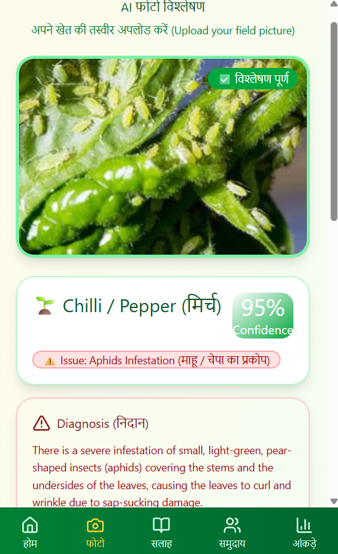

<div align="center">
  
  
  
  
  
  <h1>🌾 FarmWhisper</h1>
  <p><b>An AI-Powered Voice & Vision Assistant for Farmers</b></p>
</div>

<br />

<div align="center">
  
  <p><i>Real-time crop analysis and structured AI treatment plans.</i></p>
</div>

---

## 📖 Overview

**FarmWhisper** is a comprehensive technology solution designed to empower farmers in India (and globally) with real-time, actionable insights. By leveraging cutting-edge Artificial Intelligence (Google Gemini Vision) and intuitive interfaces, FarmWhisper bridges the gap between traditional farming and modern agritech.

Whether a farmer needs to know the weather, diagnose a diseased crop, or ask a question using only their voice, FarmWhisper provides accurate, bilingual (Hindi & English), and structured answers.

## ✨ Key Features

### 📸 1. AI Crop Pathology & Vision Analysis
Upload or snap a picture of your crop, leaf, or soil, and our strict AI Vision Pipeline will analyze it:
- **Visual Grounding:** The AI first verifies if the image is agricultural to prevent hallucinations.
- **Identification:** Automatically detects the crop species (e.g., Tomato, Cabbage, Wheat).
- **Diagnosis:** Detects pests (like Aphid infestations), diseases (like Early Blight), or nutrient deficiencies.
- **Structured Treatment Plans:** Returns a strictly formatted treatment plan with:
  - 💧 **Immediate Remedies**
  - 🐛 **Specific Pesticides/Fertilizers Needed**
  - 🌿 **Preventative Care Instructions**

### 🎙️ 2. Voice-to-Text Assistant (STT & TTS)
Designed for accessibility, farmers can simply speak their problems into the app's microphone. The app converts their voice into text, processes the agricultural query using AI, and returns a spoken solution.

### 🌤️ 3. Real-Time Weather Monitoring
Farm dashboard integrations to monitor real-time weather conditions, ensuring farmers know exactly when to water, harvest, or apply fertilizers.

### 👥 4. Community Hub
A built-in community feature where farmers can share knowledge, ask questions, and learn from other local experts.

---

## 🛠️ Technology Stack

**Frontend:**
*   React (Vite)
*   Tailwind CSS (for responsive, modern UI)
*   Lucide React (Icons)
*   Web Speech API (for Voice integration)

**Backend:**
*   Python & FastAPI
*   Google Generative AI (Gemini Flash) for Vision and NLP
*   Pydantic (for strictly typed JSON schemas)

---

## 🚀 Getting Started

### Prerequisites
*   Node.js & npm (for frontend)
*   Python 3.10+ (for backend)
*   Google Gemini API Key
*   OpenWeatherMap API Key

### Installation

1. **Clone the repository:**
   ```bash
   git clone https://github.com/adixists/FarmWhisper.git
   cd FarmWhisper
   ```

2. **Setup the Backend:**
   ```bash
   cd farmwhisper-backend
   python -m venv venv
   source venv/bin/activate  # Or `venv\Scripts\activate` on Windows
   pip install -r requirements.txt
   ```
   *Create a `.env` file in the backend folder:*
   ```env
   GOOGLE_GEMINI_API_KEY=your_gemini_key_here
   OPENWEATHER_API_KEY=your_openweather_key_here
   ```
   *Run the backend:*
   ```bash
   python -m uvicorn app.main:app --reload
   ```

3. **Setup the Frontend:**
   ```bash
   # From the root directory
   npm install
   npm run dev
   ```
   *The app will be running at `http://localhost:3000`*

---

## 🤝 Contributing
Contributions are welcome! Please feel free to submit a Pull Request.

<div align="center">
  <i>Built with ❤️ for Farmers</i>
</div>