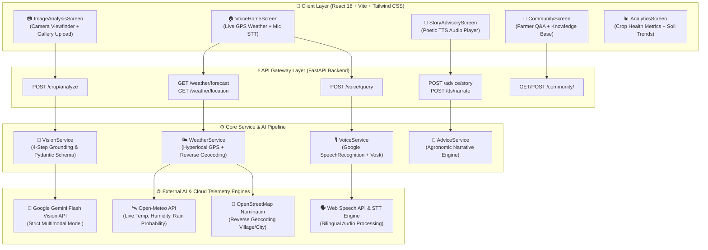
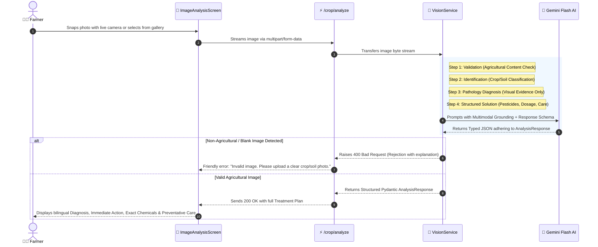
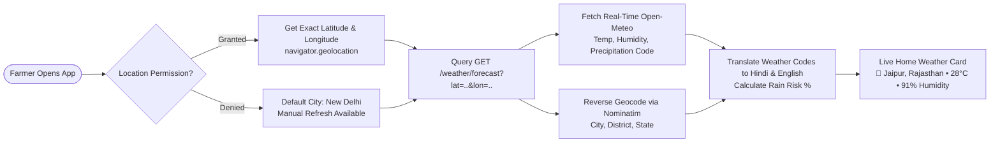

<div align="center">

# 🌾 FarmWhisper — खेती का सच्चा साथी
### *AI-Powered Voice, Vision & Real-Time Agritech Assistant for Farmers*

[](https://opensource.org/licenses/MIT)
[](https://react.dev/)
[](https://fastapi.tiangolo.com/)
[](https://ai.google.dev/)
[](https://tailwindcss.com/)
[](https://www.python.org/)

<br />

```
   🌱 Snap / Scan Crop ──► 🧠 AI Visual Grounding ──► 🧪 Treatment Plan with Exact Dosages
   🎙️ Speak in Native Tongue ──► 🗣️ Voice STT / TTS ──► 💡 Real-time Agricultural Solutions
   📍 GPS Geolocation ──► 🌤️ Hyperlocal Weather ──► 📊 Farm Risk & Irrigation Alerts
```

---

</div>

## 📌 Executive Summary

**FarmWhisper** is a comprehensive, mobile-first agricultural technology platform engineered specifically to empower farmers in India and across the globe. By combining **Google Gemini Vision AI**, **multilingual voice recognition (STT/TTS)**, **hyperlocal GPS weather telemetries**, and **community-driven knowledge exchange**, FarmWhisper turns any smartphone into an expert agronomist, crop doctor, and farming companion.

---

## 🏗️ System Architecture


```mermaid
graph TD
    subgraph Client_Layer ["📱 Client Layer (React 18 + Vite + Tailwind CSS)"]
        UI_Home["🏠 VoiceHomeScreen\n(Live GPS Weather + Mic STT)"]
        UI_Vision["📷 ImageAnalysisScreen\n(Camera Viewfinder + Gallery Upload)"]
        UI_Advisory["📖 StoryAdvisoryScreen\n(Poetic TTS Audio Player)"]
        UI_Community["👥 CommunityScreen\n(Farmer Q&A + Knowledge Base)"]
        UI_Analytics["📊 AnalyticsScreen\n(Crop Health Metrics + Soil Trends)"]
    end

    subgraph API_Gateway ["⚡ API Gateway Layer (FastAPI Backend)"]
        API_Crop["POST /crop/analyze"]
        API_Weather["GET /weather/forecast\nGET /weather/location"]
        API_Voice["POST /voice/query"]
        API_Advice["POST /advice/story\nPOST /tts/narrate"]
        API_Community["GET/POST /community/"]
    end

    subgraph Service_Pipeline ["⚙️ Core Service & AI Pipeline"]
        Vision_Service["🔬 VisionService\n(4-Step Grounding & Pydantic Schema)"]
        Weather_Service["🌤️ WeatherService\n(Hyperlocal GPS + Reverse Geocoding)"]
        Voice_Service["🎙️ VoiceService\n(Google SpeechRecognition + Vosk)"]
        Advice_Service["📜 AdviceService\n(Agronomic Narrative Engine)"]
    end

    subgraph External_Engines ["🌐 External AI & Cloud Telemetry Engines"]
        Gemini_AI["🧠 Google Gemini Flash Vision API\n(Strict Multimodal Model)"]
        OpenMeteo["🛰️ Open-Meteo API\n(Live Temp, Humidity, Rain Probability)"]
        Nominatim["📍 OpenStreetMap Nominatim\n(Reverse Geocoding Village/City)"]
        WebSpeech["🗣️ Web Speech API & STT Engine\n(Bilingual Audio Processing)"]
    end

    %% Connections
    UI_Vision --> API_Crop --> Vision_Service --> Gemini_AI
    UI_Home --> API_Weather --> Weather_Service --> OpenMeteo & Nominatim
    UI_Home --> API_Voice --> Voice_Service --> WebSpeech
    UI_Advisory --> API_Advice --> Advice_Service
    UI_Community --> API_Community
```

---

## 🔬 4-Step Crop Pathology & Vision Pipeline

To eliminate AI hallucinations and ensure maximum diagnostic accuracy, FarmWhisper enforces a **strict 4-step sequential reasoning pipeline**:


```mermaid
sequenceDiagram
    autonumber
    actor Farmer as 👨‍🌾 Farmer
    participant UI as 📱 ImageAnalysisScreen
    participant API as ⚡ /crop/analyze
    participant Vision as 🔬 VisionService
    participant Gemini as 🧠 Gemini Flash AI

    Farmer->>UI: Snaps photo with live camera or selects from gallery
    UI->>API: Streams image via multipart/form-data
    API->>Vision: Transfers image byte stream
    
    rect rgb(240, 248, 255)
        note right of Vision: Step 1: Validation (Agricultural Content Check)
        note right of Vision: Step 2: Identification (Crop/Soil Classification)
        note right of Vision: Step 3: Pathology Diagnosis (Visual Evidence Only)
        note right of Vision: Step 4: Structured Solution (Pesticides, Dosage, Care)
        Vision->>Gemini: Prompts with Multimodal Grounding + Response Schema
        Gemini-->>Vision: Returns Typed JSON adhering to AnalysisResponse
    end
    
    alt Non-Agricultural / Blank Image Detected
        Vision-->>API: Raises 400 Bad Request (Rejection with explanation)
        API-->>UI: Friendly error: "Invalid image. Please upload a clear crop/soil photo."
    else Valid Agricultural Image
        Vision-->>API: Returns Structured Pydantic AnalysisResponse
        API-->>UI: Sends 200 OK with full Treatment Plan
        UI-->>Farmer: Displays bilingual Diagnosis, Immediate Action, Exact Chemicals & Preventative Care
    end
```

---

## 🌤️ Hyperlocal GPS Weather Data Flow


```mermaid
flowchart LR
    Start([Farmer Opens App]) --> Perm{Location Permission?}
    
    Perm -- Granted --> GPS[Get Exact Latitude & Longitude\nnavigator.geolocation]
    Perm -- Denied --> Fallback[Default City: New Delhi\nManual Refresh Available]
    
    GPS --> BackendReq[Query GET /weather/forecast?lat=..&lon=..]
    Fallback --> BackendReq
    
    BackendReq --> OpenMeteo[Fetch Real-Time Open-Meteo\nTemp, Humidity, Precipitation Code]
    BackendReq --> Geocode[Reverse Geocode via Nominatim\nCity, District, State]
    
    OpenMeteo & Geocode --> Aggregate[Translate Weather Codes to Hindi & English\nCalculate Rain Risk %]
    Aggregate --> Dashboard[Live Home Weather Card\n📍 Jaipur, Rajasthan • 28°C • 91% Humidity]
```

---

## 📂 Annotated Project Directory Structure

```text
FarmWhisper/
├── 📄 package.json                  # Frontend dependencies & scripts
├── 📄 vite.config.ts                # Vite build & dev server configuration
├── 📄 start_app.bat                 # 1-Click persistent launcher for Windows
├── 📄 README.md                     # Comprehensive documentation & architecture graphs
├── 📄 index.html                    # Single-page application entry HTML
│
├── 📁 src/                          # React 18 Frontend Application
│   ├── 📄 App.tsx                   # Root navigation & screen router
│   ├── 📄 main.tsx                  # React DOM rendering entry point
│   ├── 📄 index.css                 # Tailwind CSS & global animations
│   │
│   ├── 📁 components/               # UI Feature Modules
│   │   ├── 📄 VoiceHomeScreen.tsx       # Home dashboard: GPS weather & voice mic UI
│   │   ├── 📄 ImageAnalysisScreen.tsx    # Live camera capture & AI diagnosis UI
│   │   ├── 📄 StoryAdvisoryScreen.tsx   # Poetic agronomy storytelling & TTS player
│   │   ├── 📄 CommunityScreen.tsx       # Farmer discussion forum & expert advice
│   │   ├── 📄 AnalyticsScreen.tsx       # Farm telemetry charts & health scorecards
│   │   └── 📁 ui/                       # Reusable Radix UI & Tailwind component library
│   │
│   └── 📁 services/                 # Frontend Network Client
│       └── 📄 api.ts                # REST API client with typed fetch handlers
│
└── 📁 farmwhisper-backend/          # FastAPI Python Backend
    ├── 📄 requirements.txt          # Python dependencies (FastAPI, Gemini, Pillow, etc.)
    ├── 📄 .env                      # API Keys (Google Gemini, OpenWeatherMap)
    ├── 📄 start.bat                 # Backend-only Windows launcher
    │
    └── 📁 app/
        ├── 📄 main.py               # FastAPI entry application & route controllers
        │
        ├── 📁 schemas/              # Pydantic Data Models (Type Safety)
        │   └── 📄 crop.py           # AnalysisResponse & TreatmentPlan schemas
        │
        ├── 📁 services/             # Core Backend Business Logic & AI Engines
        │   ├── 📄 vision_service.py     # Gemini Vision AI with 4-step grounding
        │   ├── 📄 weather_service.py    # Open-Meteo & Nominatim live weather engine
        │   ├── 📄 voice_service.py      # Speech-to-Text (STT) audio transcription
        │   ├── 📄 advice_service.py     # Poetic agronomist story generator
        │   └── 📄 community_service.py  # Forum posts & upvotes management
        │
        └── 📁 routes/               # Modular API Route Controllers
            ├── 📄 crop.py           # Crop analysis routes
            ├── 📄 weather.py        # Weather forecast endpoints
            ├── 📄 voice.py          # Audio streaming & speech endpoints
            ├── 📄 advice.py         # Story advisory endpoints
            └── 📄 community.py      # Community feed endpoints
```

---

## ⚡ API Specification Reference

### 1. Crop Pathology Analysis
* **Endpoint:** `POST /crop/analyze`
* **Content-Type:** `multipart/form-data`
* **Parameters:** `image` (File Blob)
* **Response:**
```json
{
  "is_agricultural": true,
  "crop_identified": "Chilli / Pepper (मिर्च)",
  "issue_detected": "Aphids Infestation (माहू / चेपा का प्रकोप)",
  "confidence_score": 0.95,
  "treatment_plan": {
    "fault_description": "Severe infestation of light-green sap-sucking aphids causing leaf curl.",
    "immediate_remedy": "Spray water forcefully on undersides of leaves to dislodge aphids immediately.",
    "pesticides_fertilizers_required": [
      "Neem Oil Spray (5ml per liter of water)",
      "Imidacloprid 17.8% SL (0.5ml per liter) for severe infestation"
    ],
    "preventative_care": "Install yellow sticky traps across the field and avoid excessive nitrogen fertilizer."
  }
}
```

### 2. Live GPS Weather Forecast
* **Endpoint:** `GET /weather/forecast?lat={latitude}&lon={longitude}`
* **Response:**
```json
{
  "temperature": 27.5,
  "humidity": 88.0,
  "rain_probability": 15.0,
  "description": "Mainly clear (मुख्यतः साफ आसमान)",
  "location": "Jaipur, Rajasthan"
}
```

### 3. Voice Query Processing
* **Endpoint:** `POST /voice/query`
* **Parameters:** `audio_file` (WAV/Audio Blob), `method` (`google` | `vosk`)
* **Response:**
```json
{
  "text": "मेरी गेहूं की फसल में पीले धब्बे दिखाई दे रहे हैं",
  "language": "hi"
}
```

---

## 🚀 Quickstart & Installation

### Option A: 1-Click Launch (Windows Desktop)
Simply double-click the **`start_app.bat`** file located in the root directory. It will automatically:
1. Open the Backend server in a dedicated window on `http://localhost:8000`.
2. Open the Frontend development server in a dedicated window on `http://localhost:3000`.

---

### Option B: Manual Setup

#### 1. Clone Repository
```bash
git clone https://github.com/adixists/FarmWhisper.git
cd FarmWhisper
```

#### 2. Backend Setup
```bash
cd farmwhisper-backend
python -m venv venv
# On Windows:
venv\Scripts\activate
# On Linux/macOS:
source venv/bin/activate

pip install -r requirements.txt
```
*Configure `farmwhisper-backend/.env`:*
```env
GOOGLE_GEMINI_API_KEY=your_gemini_api_key_here
OPENWEATHER_API_KEY=your_openweathermap_key_here
```
*Start Backend:*
```bash
python -m uvicorn app.main:app --reload --host 0.0.0.0 --port 8000
```

#### 3. Frontend Setup
```bash
# Open a new terminal in the project root
npm install
npm run dev
```
Open **[http://localhost:3000](http://localhost:3000)** in your browser!

---

## 🇮🇳 Impact on Indian Agriculture

| Challenge in Indian Farming | FarmWhisper Solution |
| :--- | :--- |
| **Language & Literacy Barriers** | Real-time speech input & Hindi-first audio advice so every farmer can interact naturally. |
| **Misleading Fertilizer Recommendations** | Strict AI vision grounding prevents guesswork and prescribes exact chemical names and dosages. |
| **Unpredictable Weather Fluctuations** | Hyperlocal GPS weather alerts help farmers avoid wasting expensive pesticides before rains. |
| **Isolated Farming Communities** | Decentralized Community Hub connects regional farmers to share proven traditional techniques. |

---

<div align="center">
  <b>FarmWhisper</b> — <i>Bridging Traditional Agronomy with Modern Artificial Intelligence 🌾</i>
</div>